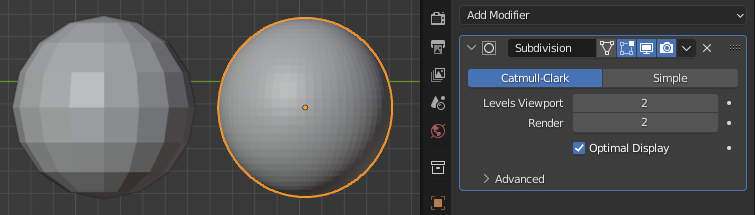
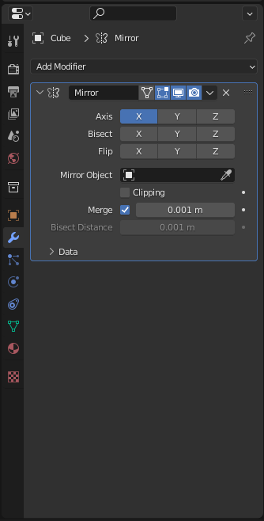

# Workshop-Blender

## How to install Blender
- Windows
- Linux

### Windows
The process is very simple :
Just go to [blender.org](www.blender.org/download/) and click `Download Blender`
(This workshop is intended on Blender 3.4.x)

### Linux
If you have snap :
`snap install blender --classic`
and execute it by typing `blender` in your terminal

If not :
Just go to [blender.org](www.blender.org/download/) and click `Download Blender`
(This workshop is intended on Blender 3.4.x)
Extract the zip folder and execute the `blender` file.

## First try
Is it your first time using Blender ? Look at this beautiful UI !
Now, first things first, try to move around the famous Default Cube that you see on your screen.
Remember our live modeling for that, use your mouse as we showed.
([Need a reminder ?](./pages/shortcuts.md))

## Serious business
No need to wait, we'll directly go deeper into Blender !
So, we want to make this beautiful cube, right ? The first part of the creation process is to setup references and / or to do the "blocking" part.

The blocking part is when you create the overall form of your objective with very simple meshs. You are just trying to match global proportions. Thus, when you will be creating your final more advanced mesh, you will have guidelines, and you will not wait until the end to discover that your proportions are messed up !

The references part is used when you are trying to recreate an existing object (this is the case here !). The goal is to add and align at least 3 images of the object you are trying to create : Top, Front, Side. Then, when you'll be doing your modeling, your goal will be to reproduce what you see, and it will be easier to align your mesh parts to match the wanted visual !
Since this is the perfect case, we'll begin with this ! Find in the [reference](./reference/) folder the reference image of the Companion Cube. Our case will be very easy as Side, Top and Front are the same, this is a perfectly symetrical cube ! Don't bother to add 3 reference image on the 3 main axis, just add one, align it with an axis, that's all you need.

##### Need help on the process ?
We will decompose it in smaller parts :
- Add an image ! We showed you how to add an object. An image is an object ! Summon the Add Object menu, and look for Image > Reference. (Download the image here : [reference](./reference/ReferenceFace.png))
- Align your image with an axis ! The easiest way is to reset its rotation with `ALT+R`.
- Now, move it on the good axis. ([Need a reminder ?](./pages/shortcuts.md)). It's better for the reference not to intersect the cube.
- Final step, scale your reference to match the cube ! For this, align your view to the good axis with the direction ball. Just click on the axis that you want.
  Now you should see something like the first image. Scale the image (and not the cube, the cube is PERFECT) to match the cube. Exactly like you can see on the second image. 

    

  
  

Tadaaam ! Great, you have your reference image !
 
 

  

## Let's start modeling !
The main structure of the Companion cube is indeed a cube, but we already have this one. We will now add more geometry to create the corners of our cube.

For this, start by creating a new cube ([Need a reminder ?](./pages/shortcuts.md)) and scale it down a little just to differenciate the two cubes.

Now we want to move this new cube to one corner of our main cube. We have more than one solution for this. All are pretty simple when you're used to them, but can be difficult at first, so let's do it one step at a time.

Use the X,Y,Z gimball at the top right of your screen to snap your view to one direction (click on one X dot, by example)
Now, you are seeing your scene in the "ortographic" way (there is no perspective). Also, if you move something, it will be dependent of your view (as we've seen during the live modeling). So, if your on the X axis, moving an object will only have effect on the Y and Z axis.
Before you do anything, select x-ray (transparency) mode by using `ALT-Z` or the little  button
Now, try to align and scale your cube to the reference, like so :

  
  

Yes, as you can see on the second image, we only aligned the cube on two axis, the last one is missing !
To correct this, use the SideBar Menu (`N`) and manually edit the cube position. Select the value of an aligned axis, and slide without unclicking to the two other axis. (Or just manually copy with copy-past, but my method is faster !). It's better to have the same value on all 3 axis for perfect symmetry.

Great, now your little cube should be on a corner of the main cube.

## Modifiers
Their is at least three differents main tools of Blender that we will discover today. You have already discovered the main viewport, to add and move objects. We will now cover the Modifiers, and we will finish by the Edition mode.

### What are the Modifiers ?

Modifiers are like a set of littles programs that you can execute on your mesh.
Modifiers can be added and removed at anytime, this is their main strenght. They do not modify the real structure of your mesh, only the final one.
Let's start with an example, on the left you can see a sphere, and on the right you can see a sphere with the [Subdivision Surface Modifier](https://docs.blender.org/manual/en/latest/modeling/modifiers/generate/subdivision_surface.html). (I strongly advise you to check this page.)

As I said, the strenght of modifiers is that they are not definitive, this is called **non destructive modeling**. I can at all time change my mind and disable this modifier, and recover my low poly sphere.
Thanks to this, if I enter the edit mode (we will see this later on), I will see and edit the original (simple) shape of the sphere, and the modifier will be reexecuted after.

    

There is plenty of modifiers in Blender, you can check the doc [here](https://docs.blender.org/manual/en/latest/modeling/modifiers/index.html).
Today, we are going to use the [Mirror modifier](https://docs.blender.org/manual/en/latest/modeling/modifiers/generate/mirror.html). Because, as I said before, our cube is symetrical. So its corners are too.
Select the corner, then, on the right of your screen, locate the modifiers tab. 

    
    

Now, with the corner selected, click `Add Modifier` > `Mirror`

Oh, no difference "before / after" ! Why ?
Simply because the corner is a symetrical cube, and is mirrored onto itself. We need to change his mirror point. To do that, click the pipette icon and click on your main large cube to select it. Now you should see spawn another corner. But, we want 8 of them, not two, so we need to mirror them on all axis and not just one. You can do that by selecting all the buttons in the "Axis" field. (shift)

Great ! Now you should have something like this :

## Edition mode
#### Introduction to the selection mode :
The edition mode is the heart of Blender, because, well, it enables you to edit meshs ! Select the corners of your Companion Cube, and press `TAB` to enter Edit Mode.
Now, you should see your cube differently. At each corner, you can see a point (called a vertex). Between them, you can see edges, and all of them create what's called a face.
You should already now the following if you listened to the live modeling, but if not, I'll explain it here quickly :
You need to master the differents selections modes to be productive in the edition mode. As I said, a mesh is composed by vertices, edges that connects vertices, and faces that are composed of edges. You can change your selection mode by clicking on 1,2 or 3 (NOT on the numpad). Or, by clicking on this menu on the top left : 
Selections modes are cross compatibles to the smaller ones, let me explain.
If you select a face in face mode, you can switch back to edge or vertex mode, because a face is the "largest" selection possible. On the other hand, if you select only one edge or one vertex, switching to face mode will discard your actual selection.
Know that `CTRL-Z` incudes the selection, so if you discard something at one point, you can `CTRL-Z` it back.
Use `TAB` to enter and exit the Edition Mode

#### Let's do it
Edition mode enables you to shape your mesh the way you want with the help of a lot of tools. *If you want to test what I am going to say, why not create a new mesh and test edition mode on it ?*
The mains tools to work with are in fact tools that you already know : Move (**G**), Rotate (**R**) and Scale (**S**).
Another tool is the Extrusion Tool, that you can activate by selecting a face (in fact you can also do it with a vertex or an edge, but let's keep it simple), and pressing **E**. You will be able to make what's is called an extrusion (yeah tools are correctly named). Just click when you're finished and hop, new face ! We are not really going to use it today, but it's a monument too great to be missed.
The last one we are going to discover today is the Bevel tool.
Select an edge of your test mesh, and click **B**. Move your mouse and click when finished. Bam, flat bevel ! Want a round bevel ? `CTRL-Z` and do it another time, but this time scroll with your mouse wheel (slowly) to increase subdivisions.
Just after you made your bevel, notice the little menu at the bottom left of your screen. If you open it, you have a lot of options that will be very useful when we will want to make more complex bevels.

Now, follow this video give a real shape to the corners of your cube.

https://user-images.githubusercontent.com/91873203/225725608-9d5d3a0e-cf63-40d5-bb47-371d617e0957.mp4

You can see that I used the bottom left menu just after my bevel to change it's shape. You will see this menu pretty often, after a modification or after adding a mesh. It enable do edit what you just made, and will disapear forever if you do anything else.

The companion cube is starting to appear !

#### New tools

We created the corners, but now we need to add the littles parts in-between.
Don't forget to exit Edit Mode.

Same approach, create one of them, scale it, align it to the reference, and so on. I'll not guide you on this part as much as I did before.

This time, you will notice that these corners are not real "corners" but more at an intermediate position. Thus, their position is equal to 0 on one of the axis. Because of this, it's useless to mirror this part on all the axis like we did before, just enable the two useful ones. We will worry about the missing parts later on.

You should now have something like this :

Let's now curve this new piece to follow the circle that the big corners make. (Switch back to edit mode with `TAB`)
I'll introduce you to a new tool of the edition mode, the **LoopCut**, that you can use with `CTRL-R`. Move your mouse on an edge and you should see a yellow line. You can see that this line make it's path all around your cube, this is called an Edge Loop. If you (slowly) scroll with your mouse, you can choose the number to add.
Left click to add them. Then, you can move them if you move your mouse, but we don't want that, so Right click to cancel this.

    
    

For this time, let's add 5 or 7 of then (an odd number will help us to have a good shape).

Let's now discover the **proportional editing** that enable you to edit things with a radius of influence like you can see on this video :

https://user-images.githubusercontent.com/91873203/232342467-55d648ed-fd8a-49ac-9988-993c429665ea.mp4

And, let's end with the **Hide** tool (`H`), that you can use to hide vertices. It's very useful because hidden vertices are not subject to proportionnal edition, so you can ensure to limit your effect only on concerned vertices.

Now look at this video and try to understaind (and replicate) what I'm doing.
But before, don't forget to activate X-Ray ! If you forget to do it, you will select only visible vertices (that's not what we want, we want to be able to select two vertices perfectly aligned despite only being able to see the closest one). To be sure to select all vertices, use box selection (left click and drag). Also, it's not displayed on the video, but each time I scale or move something, I use an axis (`G+Z` by example). Don't forget to use them.
https://user-images.githubusercontent.com/91873203/232342489-df3b1435-7763-405e-842b-b90681827a78.mp4
Again, don't hesitate to ask us questions, we are here for you :)

### Near to the end
Congratulations, you reached this part !
We're done with the edition mode, now we will finish our cube modeling by replicating our "middle corners" to each missing side of the cube.
First, let's learn to apply modifiers.
Some important things to note here :
**Most of the time, you _dont want_ to apply modifiers**, because it transform a not definitive operation into real geometry. Understaind that you can go back (exept `CTRL-Z`, but `CTRL-Z` it's note infinite). But sometime, you just want to transform you modifier into real geometry like this is our case here. Why ? Try to rotate your middle corner. You will see that the mirror modifier makes a complete mess. So we will apply it and change the origin point of our object (more on that latter on).
If you want to save a backup of your project, now is a good time. `File > Save a copy`

So ! Select your object and go to the modifiers tab. You should see your mirror modifier. Click on the little arrow and click *Apply*.
Bam, now if you rotate your object, it's not perfect, but the mirror modifier isn't interferring anymore.
So why isn't this object rotating properly ? Because of it's origin point. When an object is selected, you should see an orange point on the center of the screen. It's this object's origin point. The origin of a 3D object is like the origin of a geometrical figure, all evolves around it. We need to change it's position to the center of the object.
Right click your object > set origin > origin to geometry
It will set the origin on the center of gravity of your object, and as our is perfectly symmetrical, it will be on the center. You can try other modes !

Now, duplicate your object with `ALT-D` and rotate it with `R + Axis` on 90°. (If you have a numpad, you can type 90 on the numpad directly ! Otherwise use the `N` sidebar)

And do it once again to cover the last missing axis.

> In Blender there is two mode of duplication. `CTRL-D` that litteraly duplicate, and `ALT-D` that makes a linked copy (like a pointer) so you can edit one of the copies and apply this edition on the others.

