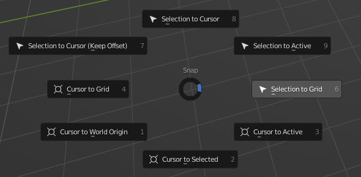

# Comprendre le 3D Cursor
In Blender, there is a tool called the 3D Cursor. This is a representation of a point in the 3D space. It enables us to do multiples things like precisely moving objects.

The first useful shortcut is `SHIFT+S`, this show this beautiful menu :

You can move your mouse to select the watnted action.
This menu allow us to snap almost everything to everything, and here, we are looking to change the position of our 3D Cursor, so we have theses options :
- Cursor to Grid
- Cursor to World Origin
- Cursor to Selected
- Cursor to Active

It's important to differenciate Selected from Active. If you're not used to the edition mode, here is a quick defintion :
- Selected designate everything selected (indeed). So if you have multiple objects selected, Cursor to Selected will set the cursor at the mean of the center of all the objects selected. So, if you have 2 objects selected, the cursor will be BETWEEN the two objects. If you have 3, the cursor will be at the center of the triangle formed by theese three objects... and so on.
- Active, on the other hand, will only use the *last* object selected

To differenciate active from selected, check this image :

Here, we have the Active, in light orange, the selected in dark orange, and a last cube that is not in the selection.

[<<< Back to the main page](../README.md)
